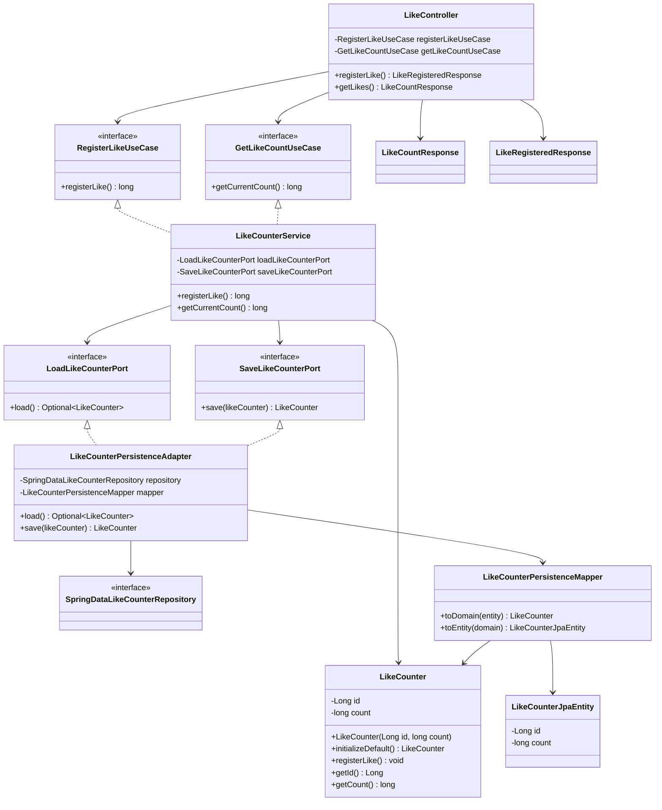

# Diagrama de clases de LikeCounterAPI

Este diagrama muestra las clases e interfaces principales del proyecto y cómo se relacionan dentro de la arquitectura hexagonal.

## Lectura pedagógica

- `LikeCounter` es la entidad del dominio.
- `LikeCounterService` implementa los casos de uso y coordina la lógica.
- `LikeController` es el adaptador de entrada REST.
- `LikeCounterPersistenceAdapter` es el adaptador de salida hacia persistencia.
- `SpringDataLikeCounterRepository` y `LikeCounterJpaEntity` pertenecen a infraestructura.
- El dominio no depende de Spring, JPA ni HTTP.
