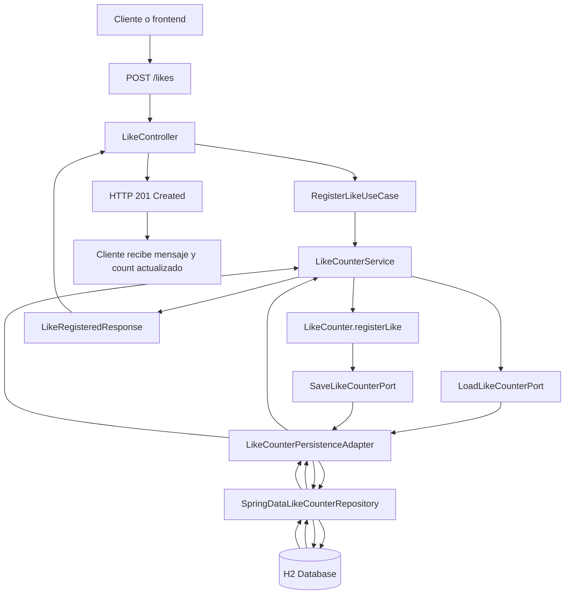

# Diagrama de flujo del caso de uso Like

Este diagrama muestra cómo viaja una petición desde el cliente hasta la base de datos y cómo vuelve la respuesta al consumidor.

## Lectura pedagógica

1. El cliente envía `POST /likes`.
2. El controlador REST recibe la solicitud y delega en el caso de uso.
3. El servicio de aplicación carga el contador actual usando un puerto de salida.
4. El adaptador de persistencia consulta H2.
5. El dominio incrementa el contador.
6. El servicio vuelve a guardar el estado actualizado.
7. El controlador construye la respuesta HTTP y la devuelve.
